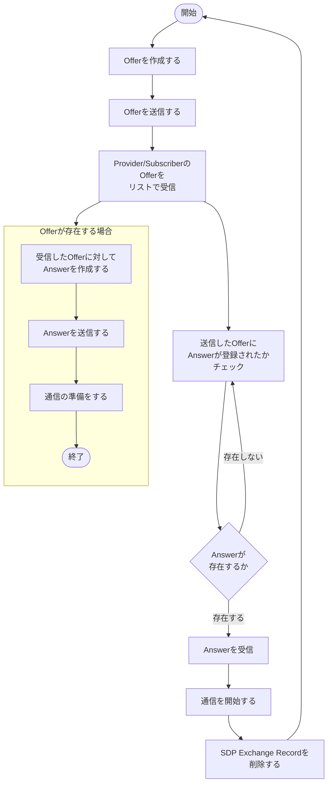

# Signaling API Specification

## JWT Token

`client_id`を含めるようにする

## 処理の流れ

SDP Exchange Recordは、Answer受信側から削除を行う

```mermaid
flowchart TD
		begin([開始])
		CreateOffer[Offerを作成する]
		SendOffer[Offerを送信する]
		ReceiveOfferList[
			Provider/Subscriberの
			Offerを
			リストで受信
		]
		CreateAnswer[
			受信したOfferに対して
			Answerを作成する
		]
		SendAnswer[Answerを送信する]
		PrepareCommunication[通信の準備をする]
		_end([終了])

		CheckAnswer[
			送信したOfferに
			Answerが登録されたか
			チェック
		]
		IfAnswerExists{
			Answerが
			存在するか
		}
		WhenAnswerExists[Answerを受信]
		BeginCommunication[通信を開始する]
		DeleteSDPRecord[
			SDP Exchange Recordを
			削除する
		]

		subgraph WhenOfferExists[Offerが存在する場合]
			direction TB
			CreateAnswer --> SendAnswer
			SendAnswer --> PrepareCommunication
			PrepareCommunication --> _end
		end


		begin --> CreateOffer
		CreateOffer --> SendOffer
		SendOffer --> ReceiveOfferList
		ReceiveOfferList --> WhenOfferExists
		ReceiveOfferList --> CheckAnswer

		CheckAnswer --> IfAnswerExists
		IfAnswerExists -- 存在する --> WhenAnswerExists
		WhenAnswerExists --> BeginCommunication
		BeginCommunication --> DeleteSDPRecord
		DeleteSDPRecord --> begin

		IfAnswerExists -- 存在しない --> CheckAnswer
```
